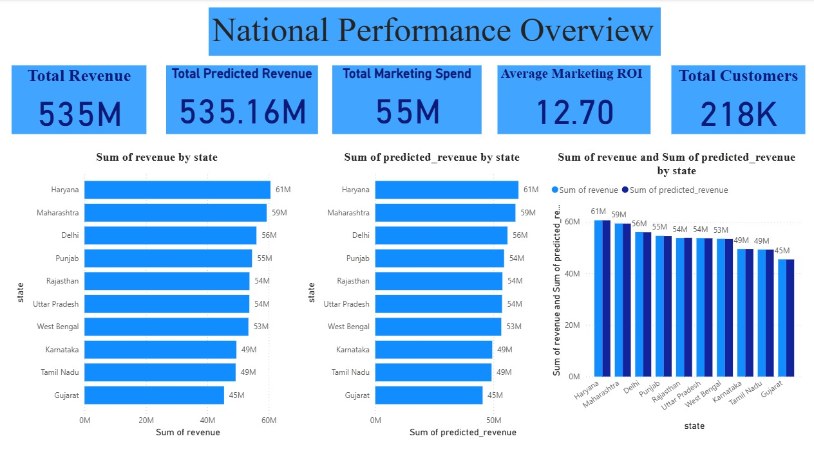

# 📊 StateWise-Business-Analytics

An interactive business analytics dashboard focused on state-wise performance insights, covering revenue, units sold, marketing spend, and customer behavior using data visualization tools.

---

## 🚀 Project Overview
This project analyzes business performance across different states to provide actionable insights for decision-making. It helps in understanding how revenue, marketing efforts, and customer engagement vary geographically.

---

## 📌 Key Features
- 📈 Revenue analysis by state
- 🛒 Units sold tracking
- 💰 Marketing spend vs ROI analysis
- 👥 Customer segmentation insights
- 🗺️ State-wise performance visualization (Map-based)
- 📊 Interactive dashboard for better insights

---

## 📊 Dashboard Insights
- Total Revenue: **535M**
- Units Sold: **512K**
- Marketing Spend: **55M**
- Unique Customers: **218K**

---

## 🛠️ Tools & Technologies Used
- Power BI (Data Visualization)
- Excel / CSV (Data Source)
- Data Cleaning & Transformation

---

## 📷 Dashboard Preview

---

## 📈 Key Learnings
- Understanding business performance metrics
- Data visualization techniques
- Importance of data-driven decision making
- Analyzing marketing ROI and customer trends

---

## 🎯 Use Case
This dashboard can be used by:
- Business Managers
- Marketing Teams
- Data Analysts
- Decision Makers

---

## 📌 Future Improvements
- Adding predictive analytics
- Real-time data integration
- Advanced customer segmentation
- Industry comparison analysis

---

## 🤝 Contributing
Contributions are welcome! Feel free to fork the repository and submit a pull request.

---

## 📄 License
This project is licensed under the MIT License.

---

## 👩‍💼 Author
**Sukhpreet Kaur**
